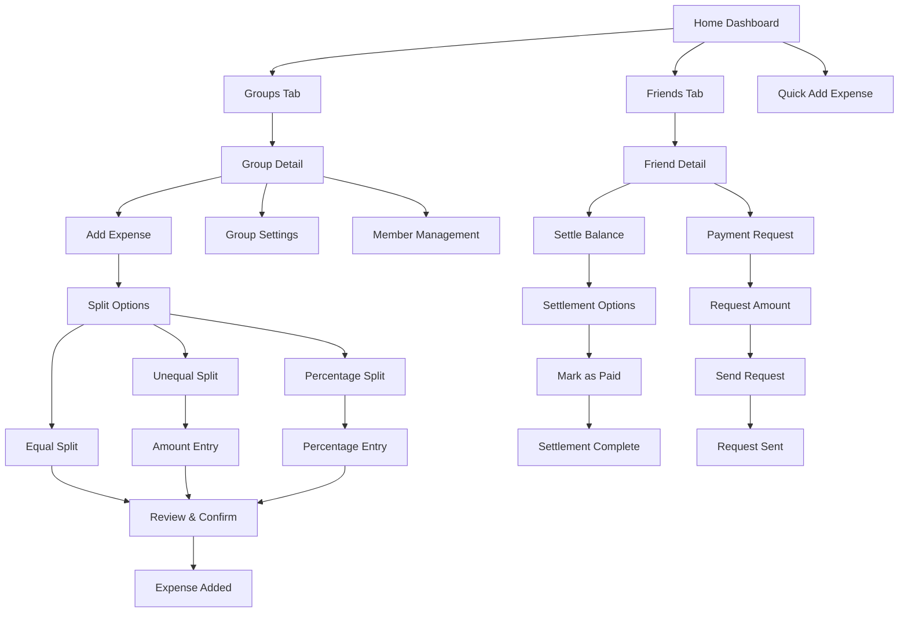

# Visual Flow Diagrams for Figma

## 🎯 Main Splitting Flow Architecture



## 🔄 Detailed Screen Flow Map

### 1. Core Navigation Structure
```
┌─────────────────┐
│   Tab Bar       │
├─────────────────┤
│ Home │Groups│   │
│Friends│Exp│Pro │
└─────────────────┘
        │
        ▼
┌─────────────────┐
│ Main Container  │
│ ┌─────────────┐ │
│ │   Content   │ │
│ │   Area      │ │
│ └─────────────┘ │
│ ┌─────────────┐ │
│ │ FAB Actions │ │
│ └─────────────┘ │
└─────────────────┘
```

### 2. Expense Creation Flow
```
Add Expense Entry Points:
├── Group Screen FAB
├── Home Quick Add
├── Template Selection
└── Recurring Setup

Add Expense Screen:
├── Amount Input (Required)
├── Description Field
├── Category Selection
├── Date Picker
├── Paid By Selection
└── Split Configuration
    ├── Equal Split
    ├── Unequal Amounts
    ├── Percentage Split
    └── Custom Shares

Confirmation Flow:
├── Review Summary
├── Split Breakdown
├── Member Notifications
└── Success/Error States
```

### 3. Settlement Flow Architecture
```
Settlement Entry Points:
├── Balance Card "Settle"
├── Friend Profile "Pay"
├── Payment Request Response
└── Smart Suggestions

Settlement Types:
├── Individual Settlement
│   ├── Select Amount
│   ├── Add Description
│   └── Mark as Paid
├── Bulk Settlement
│   ├── Multiple Selections
│   ├── Optimization View
│   └── Batch Processing
└── Smart Settlement
    ├── AI Suggestions
    ├── Debt Optimization
    └── One-Click Settle
```

### 4. Group Management Flow
```
Group Creation:
├── Basic Info
│   ├── Group Name
│   ├── Group Image
│   └── Privacy Settings
├── Member Addition
│   ├── Search Friends
│   ├── Email Invites
│   ├── QR Code Share
│   └── Contact Import
└── Group Setup Complete

Group Operations:
├── View/Edit Group
├── Member Management
│   ├── Add Members
│   ├── Remove Members
│   ├── Change Roles
│   └── Transfer Ownership
├── Group Settings
│   ├── Notifications
│   ├── Approval Rules
│   ├── Currency Settings
│   └── Privacy Controls
└── Leave/Delete Group
```

## 🎨 Screen-by-Screen Layout Specifications

### Home Dashboard Layout
```
┌──────────────────────┐
│ Header              │
│ Welcome, User Name  │
├──────────────────────┤
│ Balance Summary     │
│ ┌─────┐ ┌─────┐    │
│ │You │ │You  │    │
│ │Owe │ │Are  │    │
│ │$50 │ │Owed │    │
│ └─────┘ │$120 │    │
│         └─────┘    │
├──────────────────────┤
│ Recent Activity     │
│ ┌─────────────────┐ │
│ │ Expense 1      │ │
│ │ Expense 2      │ │
│ │ Settlement 1   │ │
│ └─────────────────┘ │
├──────────────────────┤
│ Quick Actions       │
│ [Add Exp][Settle]   │
└──────────────────────┘
```

### Group Detail Layout
```
┌──────────────────────┐
│ Group Header        │
│ Group Name & Avatar │
│ Member Count & Bal  │
├──────────────────────┤
│ Group Balance       │
│ ┌─────────────────┐ │
│ │ Total: $450.00 │ │
│ │ Your Share: $90│ │
│ └─────────────────┘ │
├──────────────────────┤
│ Members Balance     │
│ ┌─────────────────┐ │
│ │ 👤 John  +$45  │ │
│ │ 👤 Jane  -$30  │ │
│ │ 👤 Bob   +$15  │ │
│ └─────────────────┘ │
├──────────────────────┤
│ Recent Expenses     │
│ ┌─────────────────┐ │
│ │ 🍕 Dinner $120 │ │
│ │ ⛽ Gas    $45  │ │
│ │ 🎬 Movie  $60  │ │
│ └─────────────────┘ │
├──────────────────────┤
│ [+] Add Expense     │
└──────────────────────┘
```

### Add Expense Layout
```
┌──────────────────────┐
│ Add Expense Header  │
│ [×] Cancel    Save  │
├──────────────────────┤
│ Amount Input        │
│ ┌─────────────────┐ │
│ │     $  0.00    │ │
│ └─────────────────┘ │
├──────────────────────┤
│ Description         │
│ ┌─────────────────┐ │
│ │ Enter desc...   │ │
│ └─────────────────┘ │
├──────────────────────┤
│ Category            │
│ ┌─────────────────┐ │
│ │ 🍽️ Food        ▼│ │
│ └─────────────────┘ │
├──────────────────────┤
│ Paid By             │
│ ┌─────────────────┐ │
│ │ 👤 You         ▼│ │
│ └─────────────────┘ │
├──────────────────────┤
│ Split Between       │
│ ┌─────────────────┐ │
│ │ ☑️ John        │ │
│ │ ☑️ Jane        │ │
│ │ ☑️ You         │ │
│ └─────────────────┘ │
├──────────────────────┤
│ Split Type          │
│ [Equal][Unequal]    │
└──────────────────────┘
```

### Settlement Screen Layout
```
┌──────────────────────┐
│ Settle Balance      │
│ with John Doe       │
├──────────────────────┤
│ Current Balance     │
│ ┌─────────────────┐ │
│ │   You owe John  │ │
│ │     $45.50      │ │
│ └─────────────────┘ │
├──────────────────────┤
│ Settlement Amount   │
│ ┌─────────────────┐ │
│ │ $ [   45.50   ] │ │
│ └─────────────────┘ │
├──────────────────────┤
│ Payment Method      │
│ ┌─────────────────┐ │
│ │ 💳 Card        ▼│ │
│ │ 🏦 Bank        │ │
│ │ 💰 Cash        │ │
│ └─────────────────┘ │
├──────────────────────┤
│ Add Note (Optional) │
│ ┌─────────────────┐ │
│ │ Payment for...  │ │
│ └─────────────────┘ │
├──────────────────────┤
│ [Mark as Paid]      │
└──────────────────────┘
```

## 🔗 Connection Map for Figma

### Screen Connections
```
Entry Points → Main Flows → End States

Authentication:
Login → Profile Setup → Dashboard

Dashboard:
├── → Groups List → Group Detail → Add Expense
├── → Friends List → Friend Detail → Settle Balance
├── → Quick Add → Expense Form → Success
└── → Profile → Settings → Various configs

Group Operations:
Group Detail ←→ Add Expense ←→ Split Config ←→ Confirm
Group Detail ←→ Member List ←→ Member Actions
Group Detail ←→ Settings ←→ Various options

Settlement Operations:
Balance View → Settlement Form → Payment Method → Confirm → Success
Balance View → Payment Request → Amount → Send → Confirmation

Navigation Rules:
- Tab switches maintain state
- Modals overlay current context
- Back navigation preserves data
- Deep links route to specific screens
```

### Modal Hierarchy
```
Base Layer: Tab Navigation
├── Level 1: Full Screen Modals
│   ├── Add Expense Modal
│   ├── Group Settings Modal
│   └── Profile Edit Modal
├── Level 2: Overlay Modals
│   ├── Confirmation Dialogs
│   ├── Action Sheets
│   └── Date Pickers
└── Level 3: System Modals
    ├── Permissions
    ├── Alerts
    └── Loading States
```

This visual flow documentation provides a clear structure for organizing your Figma file and understanding how all the splitting features connect together.
